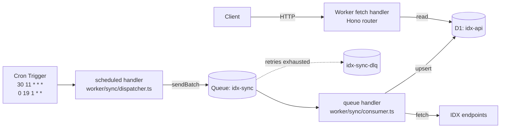

# Worker Migration — Status

Branch `worker-migration` ports the Deno + libsql + `@neabyte/deserve`
stack to **Cloudflare Workers + Hono + D1 + Queues**.

## Why the change

- Deploy to edge (latency to ID + global), free tier covers the use case
- Native Cron Triggers + Queues give per-job retry semantics with DLQ
- D1 is type-safe via Drizzle (same schema files reused)

## Architecture



## Stack mapping

| Concern        | Deno (old)                     | Worker (new)                            | Status |
|----------------|--------------------------------|------------------------------------------|--------|
| HTTP server    | `@neabyte/deserve` Router      | Hono                                     | ⏳ partial |
| Database       | `@libsql/client` + local SQLite| D1 binding (`drizzle-orm/d1`)            | ✅ wired |
| Schemas        | `src/Backend/Schemas/`         | reused as-is (vanilla `sqlite-core`)     | ✅ |
| Cron           | `Cron.ts` monolith             | Cron Trigger → Queue (fan-out)           | ✅ skeleton |
| Sync jobs      | `src/Backend/Sync/` (38 files) | `worker/sync/<kind>.ts`                  | ⏳ 1/38 |
| File serving   | `router.static('/public/img')` | R2 bucket + handler (or drop)            | ❌ TODO |
| CLI discovery  | `src/index.ts runDiscovery`    | dropped (Workers has no CLI)             | n/a |
| Tests          | `deno test`                    | Vitest + `@cloudflare/vitest-pool-workers`| ❌ TODO |
| Lint/Format    | `deno fmt + lint`              | Biome                                    | ✅ wired |

## Routes ported

| Path                             | File                                    | Status |
|----------------------------------|------------------------------------------|--------|
| `GET /`                          | `worker/routes/resource-tree.ts`        | ✅ |
| `GET /health`                    | `worker/routes/health.ts`               | ✅ (incl. D1 ping) |
| `GET /companies`                 | `worker/routes/companies.ts`            | ✅ |
| `GET /companies/:code`           | `worker/routes/companies.ts`            | ✅ |
| `GET /companies/:code/announcements` | `worker/routes/companies.ts`        | ✅ |
| `GET /companies/:code/financial-reports` | `worker/routes/companies.ts`    | ✅ |
| `GET /companies/:code/issued-history` | `worker/routes/companies.ts`       | ✅ |
| `GET /securities`                | `worker/routes/securities.ts`           | ✅ (filter: code, board) |
| `GET /stock-screener`            | `worker/routes/simple.ts`               | ✅ |
| `GET /relisting`                 | `worker/routes/simple.ts`               | ✅ |
| `GET /suspend`                   | `worker/routes/simple.ts`               | ✅ |
| `GET /announcements`             |                                          | ❌ TODO |
| `GET /market/*`                  |                                          | ❌ TODO |
| `GET /trading/*`                 |                                          | ❌ TODO |
| `GET /data/*`                    |                                          | ❌ TODO |
| `GET /participants/*`            |                                          | ❌ TODO |

## Sync jobs ported

| Kind                   | File                          | Status |
|------------------------|-------------------------------|--------|
| `indexList`            | `worker/sync/index-list.ts`   | ✅ proof |
| All other ~37 kinds    | (TODO)                        | ❌ — pattern documented in `index-list.ts`, port mechanically |

## Setup checklist (do these before `npm run dev`)

```bash
# 1. Install deps
npm install

# 2. Authenticate with Cloudflare
wrangler login

# 3. Create D1 database
wrangler d1 create idx-api
# → copy the `database_id` into wrangler.toml

# 4. Create Queues
wrangler queues create idx-sync
wrangler queues create idx-sync-dlq

# 5. Generate + apply schema
npm run db:generate            # writes drizzle/0000_*.sql
npm run db:migrate:local       # applies to local D1 (miniflare)
npm run db:migrate:remote      # applies to production D1

# 6. Run locally
npm run dev                    # http://localhost:8787

# 7. Test queue trigger manually (optional)
# In another shell:
curl -X POST http://localhost:8787/__scheduled?cron=30+11+*+*+*
```

## Known issues / risks

1. **IdxClient session caching** — Deno version held cookies in memory.
   Worker isolates are short-lived; current port ignores the cookie hack.
   If IDX endpoints reject without cookies, cache the cookie in KV.
2. **D1 free tier**: 5GB storage, 100K reads/day. Current dataset size
   not yet measured — check after first full sync.
3. **Cron min interval**: free plan supports 1-minute granularity but
   each Worker invocation is ≤30s CPU on paid (10ms on free). Long
   syncs MUST stay in Queue consumers.
4. **Port refactor cost**: 38 sync files reuse `BaseClient` and module
   classes from `src/Company`, `src/Trading`, etc. Each port either:
   (a) inlines the fetch + map, like `worker/sync/index-list.ts`, OR
   (b) refactors the original modules to take `(client)` instead of
   extending `BaseClient`. Choose one consistent style before mass port.
5. **`announcements` route shape** — Deno version uses date filters via
   `dateFrom`/`dateTo`/`companyCode`. Schema `companyAnnouncement` table
   field types unclear; will revisit.

## Next steps (suggested order)

1. ✅ Tooling + skeleton (this commit)
2. **Run `npm install` + `wrangler login`** (user action)
3. Create D1 + Queue, paste IDs into `wrangler.toml`
4. `npm run db:generate` to bootstrap migration
5. `npm run dev` → verify `/`, `/health`, `/companies` respond
6. Bulk-port remaining routes (mechanical, ~3-4 hours)
7. Bulk-port remaining sync jobs (mechanical w/ refactor of source modules)
8. Manual queue trigger to validate end-to-end one full sync
9. Replace Deno-specific files (deno.json, src/api, Cron.ts, src/Database.ts, src/Logger.ts, src/Client.ts, src/index.ts, Statistics dir) — keep schemas + sync logic
10. Update README to reflect Workers-first
11. Open PR to upstream `NeaByteLab/IDX-API` (optional)
