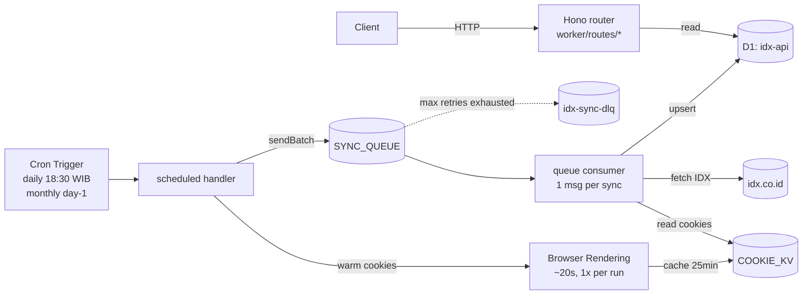

<div align="center">

# Bursarium

**IDX data at the edge.** Indonesian Stock Exchange data API serving from Cloudflare's network — zero infra, near-zero cost, sub-100ms response from Asia.

[](https://workers.cloudflare.com/)
[](https://hono.dev/)
[](https://developers.cloudflare.com/d1/)
[](https://orm.drizzle.team/)
[](LICENSE)

</div>

> **Status:** active migration from [`NeaByteLab/IDX-API`](https://github.com/NeaByteLab/IDX-API) (Deno + libsql) ke Cloudflare Workers + Hono + D1. Skeleton & cookie-warmer **sudah live**, bulk port routes/syncs in progress. Lihat [`MIGRATION.md`](./MIGRATION.md).

---

## Apa ini

Bursarium = **edge-deployed wrapper untuk seluruh data publik IDX**. Sinkronisasi otomatis dari endpoint resmi IDX → simpan terstruktur di D1 → serve sebagai REST API yang fast, gratis, dan bisa di-query dari mana saja.

38 entitas data yang di-cover (per tabel D1):

| Kategori | Data |
|----------|------|
| **Korporat** | profile, detail (board/sektor/sekretaris/komisaris), announcement, dividend, financial report, financial ratio (PER, PBV, ROE, DER), issued history |
| **Lifecycle** | new listing, additional listing, delisting, relisting, suspend, stock split, right offering |
| **Trading** | stock summary, broker summary, trade summary, top gainer, top loser, active volume/value/frequency, foreign trading, domestic trading |
| **Indeks** | index list (IHSG, LQ45, KOMPAS100, dll), daily index, index summary, index chart, sectoral movement |
| **Market** | market calendar, stock screener (26 kolom analitik) |
| **Participants** | broker participant, dealer participant, profile participant |

---

## Buat apa aja?

Tools data IDX yang lengkap + low-cost membuka banyak hal yang biasanya susah dibikin solo developer Indonesia.

### Use case langsung

| Skenario | Kenapa Bursarium ngebantu |
|----------|--------------------------|
| **Personal portfolio dashboard** | Track holding kamu vs harga close + PER/PBV/ROE realtime, no scraping pribadi |
| **Stock screener web/mobile** | Filter saham by sektor, PER, ROE, DER. Data sudah pre-aggregated di tabel `stock_screener` |
| **Algorithmic trading research** | Historical OHLC + foreign/domestic flow untuk backtest |
| **Corporate action notifier** | Webhook/bot saat ada dividend, split, RUPS, suspension untuk ticker yang kamu pantau |
| **Telegram/WhatsApp bot** | "/saham BBCA" → balas dengan close price + change + corporate actions terbaru |
| **Newsletter / Substack saham** | Bahan harian: top gainer/loser, foreign flow, IHSG sectoral movement |
| **Compliance / due diligence** | Cek apakah perusahaan masih listed, ada suspension history, atau ke-delist |
| **Akademik / tugas akhir** | Riset finance/economics — data IDX dalam bentuk SQLite langsung query, no scraping |
| **Spreadsheet integration** | Google Sheets / Excel via `IMPORTDATA` ke endpoint Bursarium |
| **AI/ML feature engineering** | Train model pakai historical fundamentals + flow data — semua sudah terstruktur |
| **Fintech MVP** | Robo-advisor, sentiment dashboard, IPO tracker — data layer ready, fokus ke produk |
| **Edukasi / kelas trading** | Show real data ke siswa tanpa harus subscribe vendor data berbayar |
| **Jurnalisme bisnis** | Quick lookup financial state issuer untuk artikel Kompas/Bisnis.com |
| **Internal tooling perusahaan** | Investment committee tools, internal stock pick tracker |

### Use case yang kurang cocok (jujur)

- **Real-time tick streaming** — Bursarium sync daily, bukan WebSocket realtime. Untuk RT pakai broker API (Stockbit/IPOT/Mirae)
- **Pre-market depth / order book** — IDX tidak expose ini publik
- **Foreign markets** — cuma IDX/BEI, tidak NASDAQ/NYSE/HKEX

---

## Quick Start

```bash
# Clone
git clone https://github.com/herbras/bursarium.git
cd bursarium

# Install
npm install

# Login + create resources di Cloudflare account kamu
wrangler login
wrangler d1 create idx-api          # copy database_id ke wrangler.toml
wrangler queues create idx-sync
wrangler queues create idx-sync-dlq
wrangler kv namespace create COOKIE_KV  # copy id ke wrangler.toml

# Browser Rendering: enable di dashboard CF
#   https://dash.cloudflare.com -> Workers -> Browser Rendering
#   Free Explorer tier: 10 jam/bulan, no kartu kredit needed

# Generate + apply schema (38 tabel)
npm run db:generate
npm run db:migrate:remote

# Deploy
wrangler deploy
# → https://bursarium.<your-subdomain>.workers.dev

# Trigger sync first time (manual, lewat queue)
# atau tunggu cron daily 18:30 WIB
wrangler queues consumer add idx-sync ...  # see MIGRATION.md
```

---

## API contract

Semua list endpoint return shape konsisten:

```json
{
  "data": [...],
  "meta": { "limit": 50, "offset": 0, "total": 845 }
}
```

Pagination universal: `?limit=50&offset=100&total=1`. Limit max 500, offset max 100K.

### Endpoint tree

```
GET /                            ← resource map
GET /health                      ← liveness + D1 ping
GET /companies                   ← all listed companies
GET /companies/:code             ← single company + detail
GET /companies/:code/announcements
GET /companies/:code/financial-reports
GET /companies/:code/issued-history
GET /securities                  ← ?code=BBCA&board=Utama
GET /stock-screener              ← analytical metrics, 26 columns
GET /suspend
GET /relisting
GET /announcements               ← ?dateFrom=20260101&dateTo=20260301
GET /market/indices
GET /market/indices/:code/chart  ← ?period=1D|1W|1M|1Q|1Y
GET /market/calendar             ← ?date=20260224
GET /market/daily-index          ← ?year=2026&month=2
GET /market/sectoral-movement    ← ?year=2026&month=2
GET /market/index-summary        ← ?date=20260224
GET /trading/summary
GET /trading/stock-summary       ← ?date=20260224
GET /trading/broker-summary      ← ?date=20260224
GET /trading/{top-gainer|top-loser|domestic|foreign|active-volume|active-value|active-frequency|industry}
                                 ← ?year&month
GET /trading/company/:code/{daily|summary}
GET /data/{additional-listing|delisting|dividend|financial-ratio|new-listing|right-offering|stock-split}
                                 ← ?year&month
GET /participants/{brokers|dealers|profiles}
```

> Note: progres port endpoint dilacak di [MIGRATION.md](./MIGRATION.md). Saat ini (skeleton commit) **8/40+ route sudah live**.

---

## Arsitektur



Tiga concerns dipisah eksplisit:

1. **API tier** — Hono + D1 read, scale otomatis di edge
2. **Cookie tier** — Browser Rendering warm IDX session 1x per cron, KV cache, semua consumer reuse
3. **Sync tier** — Cron Trigger fan-out ke Queue, consumer process 1 sync per message dengan retry + DLQ

Detail lengkap arsitektur + measured timings ada di [MIGRATION.md](./MIGRATION.md).

---

## Cost (free tier math)

| Komponen | Free tier | Estimasi pemakaian | % budget |
|----------|-----------|-------------------|----------|
| Workers requests | 100K/hari | ~5K/hari (small audience) | 5% |
| D1 storage | 5 GB | <500 MB (38 tabel × ~1 tahun data) | <10% |
| D1 reads | 5M/hari | ~50K/hari | 1% |
| D1 writes | 100K/hari | ~30K/hari (38 sync × avg 800 rows) | 30% |
| Queue ops | 1M/bulan | ~660 ops/bulan (22 sync × 30 hari) | <1% |
| Browser Rendering | 10 jam/bulan | ~10 menit/bulan | **1.7%** |
| KV reads | 100K/hari | ~3K/hari (1 read per consumer batch) | 3% |

**Total: $0/bulan** untuk skala personal/small team. Paid Workers ($5/bulan) buka headroom 10-50x.

---

## Limitasi & known issues

- **Sync hari ini (April 2026)** = data close kemarin (IDX tutup weekend). Bursarium bukan real-time tick.
- **IDX kadang ubah field names** — kalau ada field baru di response, sync tetap jalan tapi field baru ke-skip sampai schema ditambah.
- **D1 free tier write throughput** — bulk import historical (multi-year) bisa kena rate limit; gunakan chunked sync.
- **Cookie warmer race condition** — 2 cron fire bersamaan bisa double-warm. Mitigasi: KV check + 20-min freshness window. Belum diimplementasi locking eksplisit.
- **Schema tidak di-version** — kalau ubah `src/Backend/Schemas/`, migrasi D1 manual. Drizzle Kit handle ini.

---

## Roadmap

- [x] Workers + Hono + D1 skeleton
- [x] Cron Trigger → Queue fan-out
- [x] Browser Rendering cookie warmer + KV cache
- [x] Diagnostic endpoints (`/_test/*`)
- [ ] Bulk port semua route (8/40+ done)
- [ ] Bulk port semua sync job (1/38 done)
- [ ] Vitest test suite
- [ ] Static asset (company logos) via R2
- [ ] OpenAPI spec + Swagger UI
- [ ] Public Bursarium instance (read-only) di `bursarium.idx.id` atau similar
- [ ] CLI client (`bursa` command)
- [ ] Webhook subscriptions for corporate actions
- [ ] Drop legacy Deno files

---

## Berdasarkan & credit

Bursarium = port + arsitektur ulang dari **[NeaByteLab/IDX-API](https://github.com/NeaByteLab/IDX-API)**.

Yang **dipertahankan** dari upstream:
- Semua 38 schema Drizzle (`src/Backend/Schemas/`) — vanilla `sqlite-core`, portable
- Logic mapping IDX response → entity
- Endpoint coverage & pagination contract
- MIT license

Yang **diubah**:
- Runtime: Deno → Cloudflare Workers
- Server: `@neabyte/deserve` Router → Hono
- Database: local SQLite via `@libsql/client` → D1 binding
- Cron: monolithic `Cron.ts` → Cron Trigger + Queue + Consumer fan-out
- Bot bypass: in-process cookie cache → Browser Rendering + KV
- Lint: `deno fmt+lint` → Biome

Terima kasih ke @NeaByteLab atas data pipeline awal yang solid + 38 schema yang well-designed. Bursarium berdiri di atas pekerjaan beliau.

---

## Lisensi

MIT — sama dengan upstream. Pakai bebas, no warranty. Lihat [LICENSE](./LICENSE).

---

## Kontribusi

Issue + PR welcome. Sebelum bulk port menyusul, fokus utama saat ini:

1. Smoke test production deploy (tested locally, belum di-deploy real)
2. Verifikasi sustainability (cookie cache stable >24 jam? IDX tetap accept di scale?)
3. Bulk port routes & syncs dari upstream

Lihat [SMOKE-TEST.md](./SMOKE-TEST.md) untuk dekisi-tree pivot kalau Worker fetch tiba-tiba di-block.

---

<div align="center">
<sub>Built dengan ❤️ untuk komunitas developer Indonesia. Karena data publik IDX harusnya gampang diakses.</sub>
</div>
